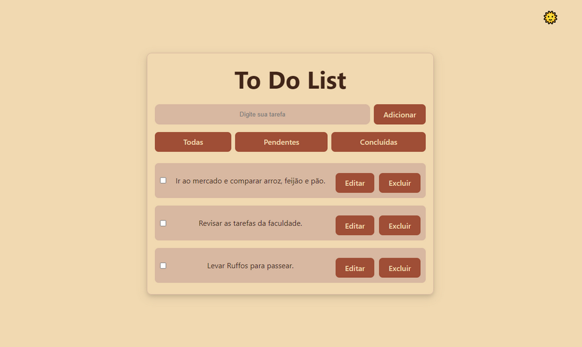

# 📋 Projeto To Do List  

Este é um projeto simples de **Lista de Tarefas (To Do List)** desenvolvido com **React**, utilizando o **Local Storage** do navegador para persistência de dados.  

---

 
> Um destaque visual do projeto rodando no navegador.

---

## 🚀 Deploy  

👉 Acesse a aplicação online: [To-Do List - Vercel](https://projeto-to-do-list-pi.vercel.app/)

---

## 🚀 Tecnologias Utilizadas  
- ⚛️ [React](https://reactjs.org/)  
- 🎨 CSS Puro  
- 💾 Local Storage  

---

## 📦 Funcionalidades  
- ➕ Adicionar tarefas  
- ✅ Marcar tarefas como concluídas  
- 🗑️ Remover tarefas  
- ♻️ Armazenamento persistente no **Local Storage**  
- 🌙☀️ Alternar entre **modo Dark e Light**  

---

## ▶️ Como Rodar o Projeto

1. **Clone o repositório:**
   ```bash
   git clone https://github.com/seu-usuario/Projeto-To-Do-List.git

2. cd Projeto-To-Do-List

3. npm install

4. npm run dev

5. Abrir o local no navegador - 
Local Host

6. Gerar versão de produção - 
npm run build

---

## 📂 Estrutura de Pastas  

```plaintext
Projeto-To-Do-List/
├── public/                # Arquivos estáticos
├── src/                   # Código-fonte
│   ├── assets/            # Imagens e ícones
│   ├── components/        # Componentes reutilizáveis
│   ├── style/             # CSS
│   ├── App.tsx            # Componente raiz
│   ├── main.tsx           # Ponto de entrada do React
│   └── index.css          # Estilos globais
├── .gitignore
├── eslint.config.js
├── index.html             # Arquivo principal da aplicação
├── package.json
├── package-lock.json
├── tsconfig.json
├── vite.config.ts
└── README.md